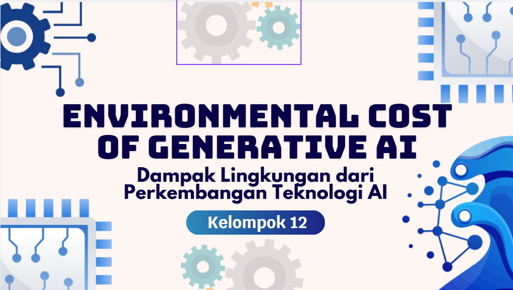

# ENVIRONMENTAL COST OF GENERATIVE AI

*"Untuk memenuhi tugas pada mata kuliah Etika Profesi"*

 

 
 

**Disusun Oleh Kelompok 12:**

| Nama Anggota | NIM |
| :--- | :--- |
| Belvaria Hendriyani | 4524210078 |
| Muhammad Fathir Alfarqi | 4524210064 |
| Putri Wahyu Dwi Nur Fatimah | 4524210080 |
| Rakha Hafidz Fauzan | 4524210082 |
| Michael Zefanya Sitompul | 4524210139 |

 

**Dosen Pengampu:**
 
Adi Wahyu Pribadi, S.Si., M.Kom

 
 

# PROGRAM STUDI TEKNIK INFORMATIKA
# FAKULTAS TEKNIK UNIVERSITAS PANCASILA
# 2026

---

## DAFTAR ISI

---

1. [BAB I PENDAHULUAN](#bab-i-pendahuluan)
   - [1.1 Latar Belakang](#11-latar-belakang)
   - [1.2 Rumusan Masalah](#12-rumusan-masalah)
   - [1.3 Tujuan](#13-tujuan)

2. [BAB II PEMBAHASAN](#bab-ii-pembahasan)
   - [2.1 Pengertian Generative AI](#21-pengertian-generative-ai)
   - [2.2 Infrastruktur AI dan Konsumsi Energi](#22-infrastruktur-ai-dan-konsumsi-energi)
   - [2.3 Dampak Lingkungan Generative AI](#23-dampak-lingkungan-generative-ai)
   - [2.4 Analisis Etika terhadap Pengembangan Generative AI](#24-analisis-etika-terhadap-pengembangan-generative-ai)
   - [2.5 Studi Kasus dan Upaya Mitigasi](#25-studi-kasus-dan-upaya-mitigasi)
   - [2.6 Trade-off Inovasi AI dan Komitmen Net-Zero](#26-trade-off-inovasi-ai-dan-komitmen-net-zero)

3. [BAB III PENUTUP](#bab-iii-penutup)
   - [3.1 Kesimpulan](#31-kesimpulan)
   - [3.2 Saran](#32-saran)

4. [DAFTAR PUSTAKA](#daftar-pustaka)

---

## BAB I PENDAHULUAN

---

### 1.1 Latar Belakang

Perkembangan teknologi kecerdasan buatan, khususnya Generative AI, telah mengalami peningkatan yang sangat pesat dalam beberapa tahun terakhir. Berbagai perusahaan teknologi besar seperti OpenAI, Microsoft, dan Google berlomba-lomba mengembangkan sistem AI canggih yang mampu menghasilkan teks, gambar, hingga kode program secara otomatis. Inovasi ini membawa banyak manfaat dalam berbagai bidang, mulai dari pendidikan, bisnis, hingga industri kreatif.

Namun, di balik kemajuan tersebut, muncul permasalahan baru yang berkaitan dengan dampak lingkungan. Pengoperasian dan pelatihan model AI skala besar membutuhkan infrastruktur komputasi yang sangat besar, seperti data center yang mengkonsumsi energi listrik dalam jumlah tinggi serta air untuk proses pendinginan. Hal ini menyebabkan peningkatan emisi karbon dan penggunaan sumber daya alam yang signifikan.

Beberapa laporan menunjukkan bahwa sejak meningkatnya penggunaan AI, emisi karbon dari perusahaan teknologi juga mengalami kenaikan. Microsoft dilaporkan mengalami peningkatan emisi karbon sekitar 30% sejak berkembangnya teknologi AI, sementara laporan keberlanjutan Google tahun 2024 menunjukkan peningkatan emisi hingga 48% dibandingkan dengan baseline tahun 2019. Kondisi ini menimbulkan kekhawatiran terhadap komitmen perusahaan-perusahaan tersebut dalam mencapai target net-zero emission.

Dari sudut pandang etika profesi, fenomena ini menimbulkan dilema antara dorongan untuk terus berinovasi di bidang teknologi dengan tanggung jawab moral untuk menjaga kelestarian lingkungan. Perusahaan teknologi tidak hanya dituntut untuk menghasilkan produk yang canggih dan menguntungkan, tetapi juga harus mempertimbangkan dampak jangka panjang terhadap lingkungan dan masyarakat. Oleh karena itu, penting untuk mengkaji lebih dalam mengenai biaya lingkungan dari pengembangan Generative AI serta menilai apakah praktik yang dilakukan saat ini sudah sesuai dengan prinsip-prinsip etika profesi.

### 1.2 Rumusan Masalah

Berdasarkan latar belakang yang telah diuraikan, maka rumusan masalah dalam makalah ini adalah sebagai berikut:

- Bagaimana dampak lingkungan yang ditimbulkan oleh perkembangan Generative AI?
- Mengapa penggunaan Generative AI dapat menyebabkan peningkatan emisi karbon dan konsumsi sumber daya seperti energi dan air?
- Bagaimana tanggung jawab perusahaan teknologi terhadap dampak lingkungan yang dihasilkan dari pengembangan AI?
- Apakah pengembangan Generative AI saat ini sudah sesuai dengan prinsip-prinsip etika profesi, khususnya dalam aspek keberlanjutan lingkungan?

### 1.3 Tujuan

Berdasarkan rumusan masalah yang telah disusun, maka tujuan penulisan makalah ini adalah sebagai berikut:

- Untuk mengetahui dan menjelaskan dampak lingkungan yang ditimbulkan oleh perkembangan Generative AI.
- Untuk menganalisis penyebab meningkatnya emisi karbon serta konsumsi energi dan air akibat penggunaan teknologi AI.
- Untuk mengkaji tanggung jawab perusahaan teknologi terhadap dampak lingkungan yang dihasilkan.
- Untuk menilai pengembangan Generative AI berdasarkan prinsip-prinsip etika profesi, khususnya dalam aspek keberlanjutan lingkungan.

---

## BAB II PEMBAHASAN

---

### 2.1 Pengertian Generative AI

_Generative AI_ merupakan salah satu cabang dari kecerdasan buatan yang dirancang untuk menghasilkan konten baru berdasarkan data yang telah dipelajari sebelumnya. Teknologi ini mampu menciptakan berbagai bentuk output, seperti teks, gambar, audio, hingga kode program, dengan tingkat kemiripan yang tinggi terhadap hasil buatan manusia.

Dalam perkembangannya, _Generative AI_ telah banyak digunakan dalam berbagai aplikasi, seperti chatbot, pembuatan desain visual, serta asistensi penulisan. Beberapa contoh teknologi _Generative AI_ yang banyak digunakan saat ini antara lain ChatGPT yang dikembangkan oleh OpenAI, Copilot oleh Microsoft, serta Gemini yang dikembangkan oleh Google.

Secara umum, _Generative AI_ bekerja menggunakan model pembelajaran mesin berskala besar yang dilatih dengan data dalam jumlah sangat besar. Proses pelatihan ini membutuhkan sumber daya komputasi yang tinggi, seperti penggunaan _Graphics Processing Unit_ (GPU) dalam jumlah besar serta waktu pemrosesan yang relatif lama. Oleh karena itu, pengembangan teknologi ini memerlukan infrastruktur yang kompleks serta konsumsi energi yang signifikan.

### 2.2 Infrastruktur AI dan Konsumsi Energi

Pengembangan dan pengoperasian _Generative AI_ tidak terlepas dari infrastruktur teknologi yang dikenal sebagai _data center_. _Data center_ merupakan fasilitas yang digunakan untuk menyimpan, mengelola, dan memproses data dalam skala besar. Dalam konteks AI, _data center_ berperan penting dalam proses pelatihan model maupun saat model tersebut digunakan oleh pengguna.

_Data center_ modern terdiri dari ribuan server yang beroperasi secara terus-menerus, sehingga membutuhkan pasokan listrik dalam jumlah yang sangat besar. Selain itu, sistem pendinginan juga diperlukan untuk menjaga suhu perangkat tetap stabil. Proses pendinginan ini umumnya menggunakan air dalam jumlah besar, sehingga turut meningkatkan konsumsi sumber daya air.

Seiring dengan meningkatnya penggunaan _Generative AI_, kebutuhan terhadap kapasitas _data center_ juga semakin meningkat. Hal ini berdampak langsung pada peningkatan konsumsi energi global yang sebagian besar masih berasal dari sumber energi tidak terbarukan. Kondisi tersebut berkontribusi terhadap peningkatan emisi karbon serta memperburuk dampak perubahan iklim.

### 2.3 Dampak Lingkungan Generative AI

Meningkatnya kebutuhan infrastruktur dan beban kerja pemrosesan di model AI menyebabkan kerusakan lingkungan yang berbahaya. Contoh penyebabnya seperti krisis air bersih, menumpuknya limbah elektronik, dan meningkatnya emisi karbon. Kebutuhan sumber daya listrik yang sangat besar dari _data center_ yang mayoritas sumbernya masih kebergantungan di pembangkit berbahan bakar fosil menjadi penyebab meningkatnya emisi karbon yang cukup tinggi, di mana untuk pelatihan satu model AI saja bisa menghasilkan emisi setara dengan beberapa mobil untuk seumur hidup mobil tersebut. Selain itu, sistem pendingin pada _data center_ memerlukan jutaan liter air tawar supaya server tidak terjadi _overheat_ yang beresiko memperparah krisis air bersih jika fasilitasnya dibangun di daerah rawan kekeringan. Karena dituntutnya inovasi yang cepat, ini memaksa semua perusahaan untuk terus memperbarui perangkat keras sehingga memperpendek siklus hidup perangkat keras dan mempercepat penumpukan limbah elektronik yang mengandung bahan racun.

### 2.4 Analisi Etika terhadap Pengembangan Generative AI

Secara perspektif etika profesi, kemajuan AI memunculkan dilema moral diantara inovasi teknologi yang mempermudah manusia dan pelestarian lingkungan. Jika dilihat dari sisi manfaatnya, AI memberikan efisiensi yang sangat besar bagi peradaban manusia saat ini. Tapi dampak buruknya kepada iklim bumi lebih berpotensi menciptakan kerugian massal secara jangka panjang yang bisa menghilangkan nilai dari manfaat AI tersebut. Secara etis, perusahaan teknologi memiliki kewajiban moral untuk menepati komitmen _net-zero emission_ yang telah mereka tetapkan, yang artinya, mereka telah mengorbakan janji tersebut demi memenangkan perlombaan bisnis AI adalah bentuk pelanggaran etika. Lalu, jika dilihat dengan pendekatan _Triple Bottom Line_ juga memberitahu bahwa praktik AI saat ini belum sepenuhnya etis karena terlalu berat sebelah pada pencapaian keuntungan finansial dan kenyamanan pengguna, tapi masih mengabaikan daya dukung untuk kelestarian bumi.

### 2.5 Studi Kasus dan Upaya Mitigasi

Perkembangan Generative AI yang pesat tidak terlepas dari peran perusahaan teknologi besar seperti Microsoft dan Google. Namun, peningkatan penggunaan AI juga diikuti oleh meningkatnya dampak lingkungan yang dihasilkan. Microsoft dilaporkan mengalami peningkatan emisi karbon sekitar 30% sejak berkembangnya teknologi AI, sementara Google melaporkan peningkatan emisi hingga 48% dibandingkan tahun 2019.

Peningkatan ini menunjukkan bahwa kebutuhan komputasi untuk mendukung AI, termasuk penggunaan data center dalam skala besar, memberikan kontribusi langsung terhadap konsumsi energi dan emisi karbon. Hal ini menimbulkan pertanyaan kritis mengenai konsistensi perusahaan dalam menjalankan komitmen net-zero emission yang sebelumnya telah dicanangkan.

Kondisi tersebut mencerminkan adanya dilema antara dorongan untuk terus berinovasi dengan tanggung jawab terhadap lingkungan. Jika tidak diimbangi dengan langkah mitigasi yang serius, maka perkembangan teknologi AI berpotensi memperburuk kondisi lingkungan secara global.

Upaya Mitigasi Dampak Lingkungan:

- **Penggunaan Energi Terbarukan** 
  Perusahaan teknologi dapat beralih ke sumber energi terbarukan seperti tenaga surya dan angin untuk mengurangi emisi karbon dari operasional data center.
- **Pengembangan Green AI** 
  Mengembangkan model AI yang lebih efisien dalam penggunaan energi, seperti mengoptimalkan algoritma dan mengurangi kompleksitas model tanpa mengorbankan performa.
- **Efisiensi Data Center**
  Meningkatkan efisiensi infrastruktur dengan menggunakan sistem pendinginan yang lebih hemat energi serta memanfaatkan teknologi ramah lingkungan.
- **Pengelolaan Konsumsi Air**
  Mengurangi penggunaan air dalam proses pendinginan dan menerapkan sistem daur ulang air untuk menjaga ketersediaan sumber daya air.
- **Transparansi dan Pelaporan**
  Perusahaan perlu secara terbuka melaporkan dampak lingkungan yang dihasilkan, seperti emisi karbon dan konsumsi energi, agar dapat diawasi oleh publik.
- **Kepatuhan terhadap Regulasi**
  Mengikuti kebijakan dan standar pemerintah terkait lingkungan, seperti pembatasan emisi dan penggunaan energi bersih.

### 2.6 Trade-off Inovasi AI dan Komitmen Net-Zero

Perkembangan Generative AI yang sangat pesat membawa dilema antara inovasi teknologi dan keberlanjutan lingkungan. Di satu sisi, perusahaan teknologi seperti Microsoft dan Google terus mendorong pengembangan AI untuk meningkatkan efisiensi, produktivitas, dan keuntungan bisnis. Namun, di sisi lain, peningkatan kebutuhan komputasi untuk AI menyebabkan konsumsi energi dan emisi karbon yang semakin tinggi.

Hal ini menimbulkan trade-off yang signifikan, yaitu antara upaya mempercepat inovasi teknologi dengan komitmen perusahaan untuk mencapai target net-zero emission. Data menunjukkan bahwa sejak meningkatnya penggunaan AI, emisi karbon perusahaan justru mengalami kenaikan, seperti Microsoft yang meningkat sekitar 30% dan Google hingga 48% dibandingkan baseline sebelumnya.

Kondisi ini menunjukkan adanya ketidaksesuaian antara komitmen keberlanjutan yang dicanangkan perusahaan dengan praktik operasional yang terjadi di lapangan. Dalam konteks etika profesi, hal ini dapat menimbulkan pertanyaan kritis mengenai konsistensi dan tanggung jawab moral perusahaan terhadap lingkungan.

Dengan demikian, pengembangan Generative AI saat ini berada pada posisi dilematis, di mana inovasi yang dihasilkan berpotensi mengorbankan aspek keberlanjutan. Oleh karena itu, diperlukan strategi yang mampu menyeimbangkan antara kemajuan teknologi dan tanggung jawab lingkungan agar kedua tujuan tersebut dapat berjalan secara beriringan.

---

## BAB III PENUTUP

---

### 3.1 Kesimpulan  

Perkembangan *Generative AI* telah memberikan berbagai manfaat signifikan dalam kehidupan manusia, khususnya dalam meningkatkan efisiensi kerja, mendorong inovasi, serta mempercepat transformasi digital di berbagai bidang.  

Namun, di balik manfaat tersebut, terdapat dampak lingkungan yang tidak dapat diabaikan, seperti meningkatnya emisi karbon, tingginya konsumsi energi, serta penggunaan air dalam jumlah besar pada infrastruktur *data center*.  

Dari sudut pandang etika profesi, kondisi ini menimbulkan dilema antara kemajuan teknologi dan tanggung jawab terhadap lingkungan. Berdasarkan analisis menggunakan pendekatan **utilitarianisme**, **deontologi**, dan **Triple Bottom Line**, dapat disimpulkan bahwa pengembangan *Generative AI* saat ini belum sepenuhnya memenuhi prinsip etika, terutama dalam aspek keberlanjutan dan tanggung jawab lingkungan.  

Oleh karena itu, diperlukan kesadaran serta komitmen yang lebih kuat dari perusahaan teknologi agar inovasi yang dilakukan tidak mengorbankan kelestarian lingkungan. Keseimbangan antara aspek **profit**, **people**, dan **planet** menjadi kunci utama dalam menciptakan pengembangan teknologi yang etis dan berkelanjutan.  

### 3.2 Saran  

Berdasarkan pembahasan yang telah dilakukan, berikut beberapa saran yang dapat dipertimbangkan:

#### 1. Bagi Perusahaan Teknologi  
Perusahaan diharapkan lebih bertanggung jawab dalam mengelola dampak lingkungan dengan menerapkan konsep *Green AI*, menggunakan energi terbarukan, serta meningkatkan transparansi dalam pelaporan lingkungan.  

#### 2. Bagi Pemerintah  
Pemerintah perlu menetapkan regulasi yang tegas terkait batas emisi karbon, efisiensi energi, dan penggunaan sumber daya, sehingga perkembangan teknologi tetap sejalan dengan prinsip keberlanjutan.  

#### 3. Bagi Pengembang Teknologi (*Developer*)  
Pengembang diharapkan mempertimbangkan aspek efisiensi serta dampak lingkungan dalam merancang sistem AI, sekaligus menjunjung tinggi nilai-nilai etika profesi.  

#### 4. Bagi Masyarakat/Pengguna  
Pengguna diharapkan menggunakan teknologi AI secara bijak dan tidak berlebihan, serta meningkatkan kesadaran terhadap dampak lingkungan dari penggunaan teknologi digital.  

---

## DAFTAR PUSTAKA

---
  
- Microsoft. (2024). *Microsoft Environmental Sustainability Report 2024*. Microsoft Corporation.  
- Google. (2024). *Google Environmental Report 2024*. Google LLC.  
- Strubell, E., Ganesh, A., & McCallum, A. (2019). *Energy and Policy Considerations for Deep Learning in NLP*. Nature Climate Change, 10(1), 1–6.  
- Hao, K. (2019). *Training a Single AI Model Can Emit as Much Carbon as Five Cars in Their Lifetimes*. MIT Technology Review.  
- International Energy Agency. (2023). *Data Centres and Data Transmission Networks*. IEA.  

---

### 🎥 Presentasi Proyek

	

### 📎 Lampiran Proyek

> **Link Presentasi:** [Akses Slide PPT di Canva](https://canva.link/wpsxapkqddbm5g9)

